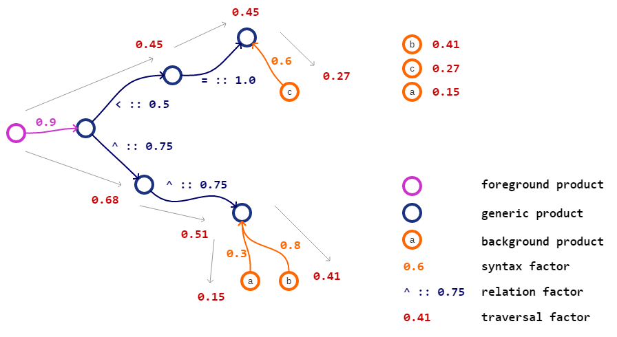

# pslink

pslink is an experimental project for the creation of product systems from
assembly part and component trees and the linking of the resulting processes
with LCI data from background databases like the
[LCA Commons](https://www.lcacommons.gov/). To achieve this, different
functions are implemented in `pslink` which are described below.



## Usage
Checkout the project and install it (preferably in a
[virtual environment](https://docs.python.org/3/library/venv.html)):

```bash
# get the project
$ git clone https://github.com/msrocka/pslink.git
$ cd pslink

# create a virtual environment and activate it
$ python -m venv env
$ .\env\Scripts\activate.bat

# install the requirements
$ pip install -r requirements.txt

# install the project
$ pip install -e .

# ... then start the Python interpreter
$ python
```

`pslink` has a single entry point that reads data files from a folder and
writes back its output to this folder:

```python
import pslink
pslink.link("./data")
```

The content and layout of this data foder is described below. `pslink` uses
the standard logger from the `logging` package which you can configure like
this:

```python
import logging as log

# set the log level to info to see more details
log.basicConfig(level=log.INFO)  
```

## The data folder
The data folder has the following layout:

```
data/
|-- components/
|   |-- [component ID 1].txt
|   |-- [component ID 2].txt
|   +-- ...
|-- out/
|   |-- generated_jsonld.zip
|   +-- linked_graph.semapl
|-- background_products.txt
|-- densities.txt
|-- product_net.semapl
|-- [component tree 1].xlsx
|-- [component tree 2].xslx
+-- ...
```

### `components/`
This folder containts simple text files that contain component attributes like
dimensions or material compositions as key-value pairs. The files are stored
with the respective component IDs as names. In such a file, each line contains
a key-value pair seperated by semicolon (leading and trailing whitespaces are
ignored):

```
[attribute name] ; [attribute value]
```

### `out/`
This folder contains the generated output: 

* `generated_jsonld.zip`: is the generated JSON-LD package that contains the
  foreground processes linked to the products and processes of the background
  database that can be imported into this database (in openLCA).
* `linked_graph.semapl`: the semantic product graph with mapped products of the
  background database containing syntax factors (see below for details), e.g.:

```r
# "synthetic rubber, at plant" is mapped with a syntax factor of 0.333333
# to "acrylonitrile butadiene rubber"
"synthetic rubber, at plant" , "acrylonitrile butadiene rubber"^0.333333
```

### `background_products.txt`
The file `background_products.txt` contains the information of the products
in the background database against which the foreground system should be linked.
It is a plain text file with the following tab-separated columns:

```
0: PROCESS_UUID
1: PROCESS_NAME
2: FLOW_UUID
3: FLOW_NAME
4: UNIT
```

This file can be easily generated for any database by executing the following
script in the openLCA SQL editor and pasting the result into the file:

```sql
select
  p.ref_id as process_uuid,
  p.name   as process_name,
  f.ref_id as flow_uuid,
  f.name   as flow_name,
  u.name   as unit
  from tbl_processes p
  inner join tbl_exchanges e on p.id = e.f_owner
  inner join tbl_flows f on e.f_flow = f.id
  inner join tbl_units u on e.f_unit = u.id
  where f.flow_type = 'PRODUCT_FLOW'
    and e.is_input  = 0
    and u.name      = 'kg'
```

## How it works

### Quantification
In order to combine the parts and components of the foreground system with
background data in a meaningful way, their dimensions and material composition
have to be quantified in some way. For standard parts and components there are
online databases, such as [PartTarget](http://www.parttarget.com), from which
such information can be retrieved. The corresponding masses can then be
estimated by the resulting volumes and material densities.

However, for different parts and components very different attributes that
describe their dimensions can occur. In order to solve this, volume formulas
can be dynamically registered in `pslink`, which determine the volume for a
given set of dimension attributes, e.g.:

```python
import pslink.quant as quant

quant.VolumeFormula.register(
    {
        "Outside Diameter": "d_outer",
        "Center Hole Diameter": "d_inner",
        "Cross-Sectional Height": "h"
    },
    "(pi / 4) * h * (d_outer^2 - d_inner^2)"
)
```

For a set of properties of an assembly part (saved as key-value pairs), 
the function `volume_cm3(properties)` in the `pslink.quant` then searches
for a matching formula and calculates a volume. Length attributes, that `pslink`
understands, can be texts like `42.42 inches nominal` or even ranges like
`21.21 inches minimum and 42.42 inches maximum` (where the mean value is then
taken for calculating an estimated volume). With a set of corresponding
densities, the weights of the materials in an assembly part can be estimated.


### A semantic network of product relations

The core component of `pslink` is a 
[semantic network](https://en.wikipedia.org/wiki/Semantic_network)
of products in which the following types of relations between these
products are stored:

* is exactly the same
* is more generic (is broader) 
* is more specific (is narrower)
* is derived from

In order to quickly create such a semantic product network, a simple,
text based, and from [WordNet](https://wordnet.princeton.edu/documentation/wninput5wn)
inspired data format with the following properties was developed:

* Each line contains the relationships of a product (the _subject_),
  which comes first, to one or several other products (the _objects_),
  which follow the subject in the same line.
* Product names are enclosed in quotation marks. The relationship
  of the subject to an object is indicated by a symbol at the end of
  the object's product name, where

  * `=` means `is same`
  * `^` means `is broader` (the inverse relation `is narrower` is
    automatically added)
  * `<` means `is derived from`

* Commas can be set as visual separators but are ignored like
  whitespaces. Lines that start with a `#` are ignored as
  comments.

The following example describes that "stainless steel" `is a`
"steel" and the `same as` "corrosion resistant steel", and
that a "steel product" `is a` "metal product" which is
`derived from` (made from) "steel".

```r
# a simple example
"stainless steel" ,  "corrosion resistant steel"=  ,  "steel"^
"steel product"   ,  "metal product"^              ,  "steel"<
```

The function `read_file` in the `semap` module parses such a
file and creates the corresponding graph data structure:


```python
import pslink.semap as semap

graph = semap.read_file("path/to/file.smapl")
```


### Connect LCI background data to the network

The product names in the semantic network can be very generic (e.g. from a
product classification or from sources such as of Wikipedia). These generic
product names can then be linked to concrete product information from an LCI
background database with the `link_products` method of the `pslink` graph
structure. This method takes a function as input which calculates
a _syntactic matching score_ between the generic product names in the graph and
the product names in the LCI database. The products from the LCI database with
the maximum score (if exist) are then linked to the respective (generic)
product name in the graph.

The syntax of product names in an LCI database often follows certain rules,
such as:

```ebnf
<product name> = <primary product>, {"," | ";", <qualifier>}.
```

This is considered with functions like `compare_with_lci_name` in the
`pslink.symap` module that will give the matching primary product name
a higher score than the matching of qualifiers (like `at plant`) when
comparing them with a (generic) product name in the graph. The assigned
products and their syntax scores can be explored when writing the graph
back to a file with the `write_file` function in the `pslink.semap` module,
e.g.:

```r
# fluorocarbon-based synthetic rubber
"synthetic rubber, at plant" , "fluorocarbon-based synthetic rubber"^0.666667

# high carbon steel
"steel, electric, chromium steel 18/8, at plant" , "high carbon steel"^0.562500
"steel, converter, chromium steel 18/8, at plant" , "high carbon steel"^0.562500
```


### Product search
The image below shows how the search for products in a background database for
a given foreground product works. First, (generic) product nodes are searched
via syntax and text analysis. Starting from each such node with a matching
factor (syntax factor; `0.9` in the example) `> 0` the graph is traversed along
the product relations. Each relation type has a specific factor assigned:

* `= is same`: `1.0`
* `^ is broader | is narrower`: `0.75`
* `< is derived from` : `0.5`

The background products which are bound to the nodes, again with a syntax
factor, are collected during this traversal and ranked by a score that is
calculated by multiplying the syntax and relation factors along a traversal
path. The background products with the maximum score are then returned from
the search.


**Note**: Currently only background products with the same, maximum, syntax
score are bound to a node. This is fine, but when an additional
meta-data score is applied all background products with a syntax score `> 0`
should be bound to a node.


### Meta-data scoring

This is currently not implemented but the product search could be easily
extended to also include meta-data like geography or time into the ranking:
Just store these meta-data fields into additional columns in the
`background_products.txt` file and rank these fields against an extended
search query.
